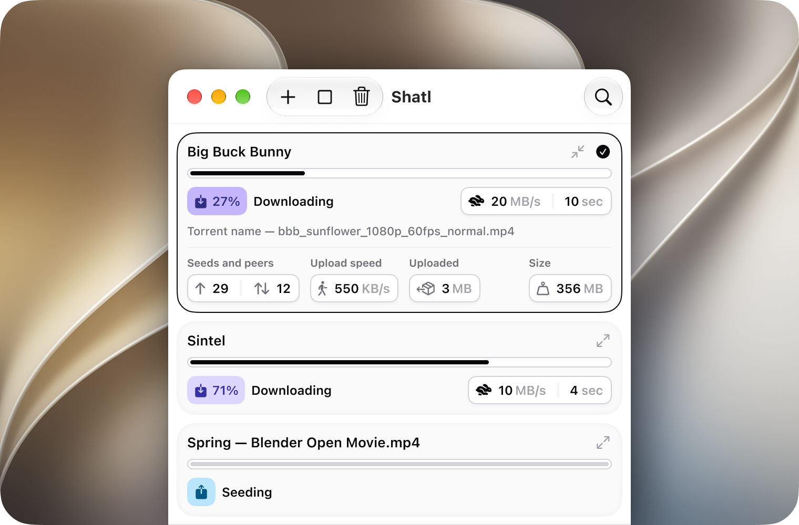
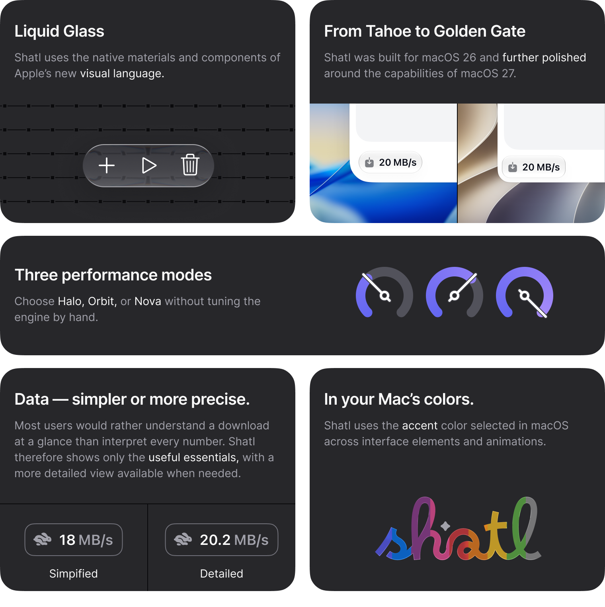

<div align="center">


# Shatl

**A lightweight, open-source BitTorrent client built for Apple Silicon Macs.**

Choose files before a download begins, tune performance without touching engine
settings, and follow progress without unnecessary visual noise.

[Download the latest release](https://github.com/mamontov-design/shatl-updates/releases/latest)
·
[View update history](https://github.com/mamontov-design/shatl-updates/releases)




<br><br>



</div>

## Made for clear, intentional downloads

- **Choose before downloading.** Open a `.torrent` file or magnet link, inspect
  its contents, select only the files you need, and choose where to save them.
- **See the right amount of detail.** Use simplified metrics for an at-a-glance
  view or switch to detailed values when precision matters.
- **Tune performance in one step.** Pick Halo, Orbit, or Nova instead of editing
  low-level libtorrent settings by hand.
- **Make downloads recognizable.** Give a torrent a clear alias while keeping
  its original name available when needed.
- **Feel at home on macOS.** Shatl uses SwiftUI, native materials, the system
  accent color, notifications, and Reduce Motion support.
- **Use it in your language.** The interface is available in English, German,
  Spanish, French, Russian, Japanese, and Simplified Chinese.

Shatl is built on [libtorrent](https://www.libtorrent.org/) and restores your
session between launches, including downloads that need attention.

## Download

Download `Shatl-1.0.zip` from the
[latest release](https://github.com/mamontov-design/shatl-updates/releases/latest),
extract it, and move `Shatl.app` to the Applications folder.

The first release is not notarized. If macOS blocks the first launch, open
**System Settings → Privacy & Security** and choose **Open Anyway** for Shatl.
Future updates are delivered in the app through
[Sparkle](https://sparkle-project.org/).

## Requirements

- Apple Silicon Mac
- macOS 26 or later

Building from source additionally requires Xcode 27 or later.

## Building from source

1. Clone the repository.
2. Open `Shatl.xcodeproj` in Xcode 27 or later.
3. Select the `Shatl` scheme and build for **My Mac**.

Prebuilt arm64 dependencies are stored in `Vendor/Artifacts`. To rebuild them,
run:

```sh
Scripts/build-openssl.sh
Scripts/build-libtorrent.sh
```

## Privacy

Anonymous usage statistics are opt-in. When enabled, Shatl sends at most one
aggregate report per week containing the launch count, app version, and
interface language. It does not send torrent contents, file names, paths, or
magnet links, and the payload can be inspected from the app before it is sent.

Diagnostic file logging is disabled by default and cannot be activated in
release builds.

## License and responsible use

Shatl's first-party source code is licensed under
[GNU GPL version 3 only](LICENSE). Third-party components remain under their
respective licenses; see [THIRD-PARTY-NOTICES.md](THIRD-PARTY-NOTICES.md).

The Shatl name, wordmark, logomark, and application icon are covered by a
separate [brand and trademark policy](TRADEMARKS.md). The GPL license does not
grant permission to present modified software as an official Shatl release.

BitTorrent is a data-transfer protocol, not permission to infringe copyright.
Please download and share only lawfully available content.

Shatl was created with AI assistance under the author's direction. Product and
design decisions remain human-led.
